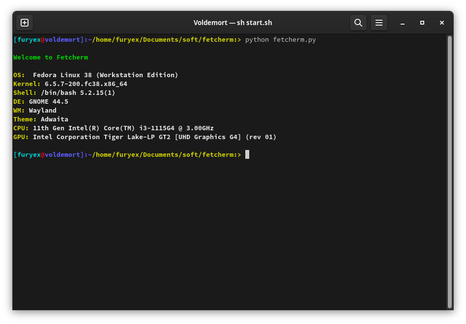

### Fetcherm - Detailed PC Information Tool

#### Screenshot


*shell: term*


#### How you can run fetcherm

```sh
python fetcherm.py 
```

#### OR

You will be able to run it integratedly on the [Term](https://github.com/furyex2dev/term)